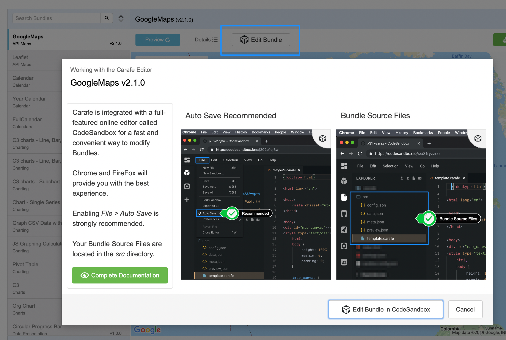
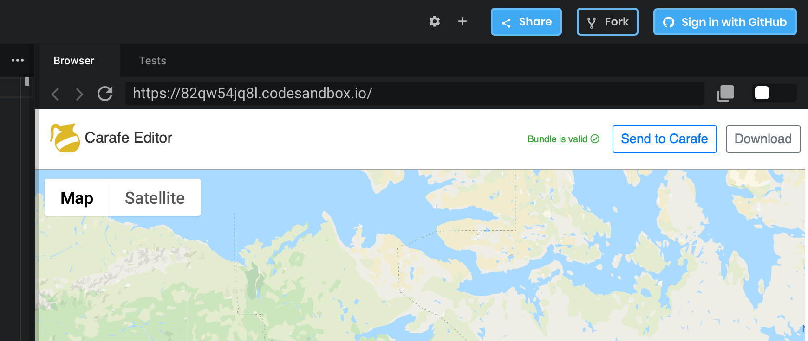

When you click on Edit Bundle in Carafe.fmp12, it will extract the source code and open it for you to edit in the powerful and convenient online editor, CodeSandbox.

Before launching, you will be presented with a few usability tips.

# Caveats

CodeSandbox is intended to be a quick and easy way to make configuration changes and basic edits to your Bundles, but if you intend to do any serious development work, you should really consider working with a professional desktop JavaScript editor and [Carafe Bundle Creator](../../carafe-bundle-creator).

# Browser Compatibility

CodeSandbox does work in Safari, but we've tended to see more issues with browser restrictions in Safari. It does not work at all in Internet Explorer, and we have not tested it meaningfully in Edge.

Your best bet is to use Chrome or FireFox when working with Carafe Editor in CodeSandbox.

# Recommended Settings

You have the option in CodeSandbox to enable Auto Save. We've found this to prevent a few problems with the saved state of your files. See `File > Auto Save` as shown in the screen capture above.

# Working With Source Files

The Carafe Editor and other settings files get pushed to the CodeSandbox environment along with your Bundle's source files. The files you need to work with are in the `src` directory. You should ignore the files outside of that.

# Carafe Editor Toolbar

Within your main browser, you'll find a pane that contains an inner browser as shown in the screen capture here. The Carafe Editor toolbar will normally show you the Bundle validation status, and for valid Bundles, it will give you the options to "Send to Carafe" or "Download" the Bundle.

## Send to Carafe Button

Send to Carafe will attempt to use an fmp:// url to push the compiled Bundle back over to FileMaker. This will only work if Carafe.fmp12 is already open, and it is subject to the url length restrictions on Windows.

## Download Button

Download will instead compile the Bundle and send it to your browser for download. Use this option when you need the Bundle as a file, or when Send to Carafe is not available to you.

# Troubleshooting

* Browser doesn't render the Bundle

CodeSandbox is a complex memory intensive app. Sometimes CodeSandbox will arbitrarily not render your Bundle. To give yourself the best chance, try not to open more than one instance at a time. If the inner browser doesn't refresh on its own, you can try refreshing it manually with the refresh icon just above the Carafe logo. If that doesn't work, you can try reloading your main host browser. If refreshing doesn't work, it's possible that your Bundle has an error in it which is causing the problem. You can use your browser's Developer toos to try to figure out what's crashing if this happens.

* File refuses to save

Sometimes CodeSandbox gets in a state where it prevents you from saving because it seems to think that what's on disk is newer. Often this is actually spurious. In any case, sometimes your only option is to copy the unsaved editor contents to your clipboard, and then reload the whole browser. Then as needed, you can paste your edited code back in place.
