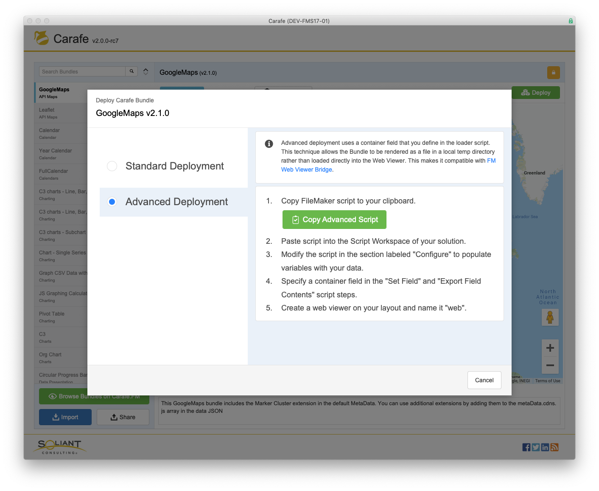

When you have it configured and are ready to deploy a Bundle into your solution, click Deploy. You will be given the options to use Standard and Advanced deployment scripts. Follow the onscreen instructions to use either option.

The Advanced option is nearly identical to the Standard option, but it differs in that it needs you to configure a container field before it will run. The container field allows the rendered Bundle to be output to the temp directory of the file system, and called from there, rather than being directly set in the Web Viewer as html. This gives you the option to integrate with FM WebViewer Bridge if you need to. It also can be useful for troubleshooting the output in a browser outside of FileMaker.

