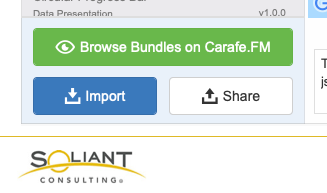
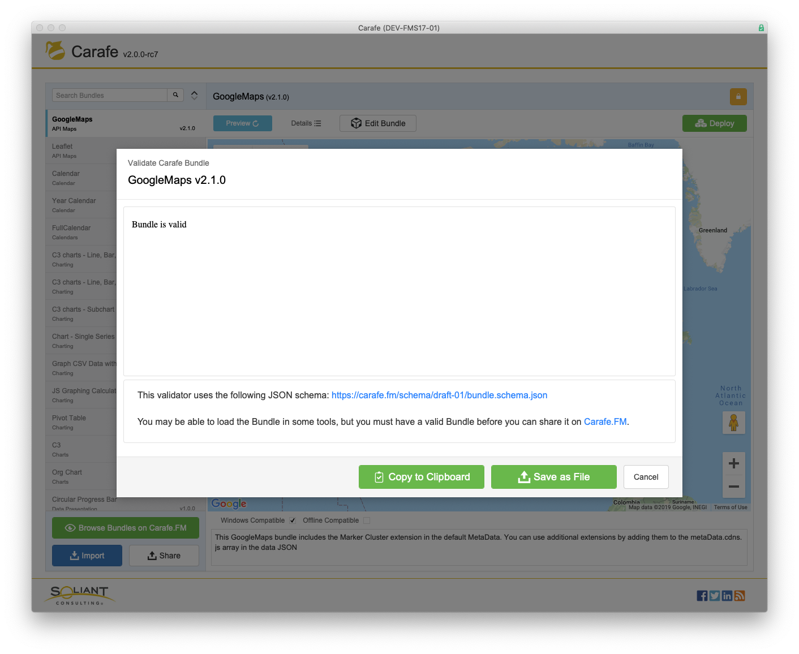

In the lower left corner of the Bundles layout there are buttons for importing and exporting compatible Bundles that you got from Carafe.FM or any other source.

## Import

Clicking Import opens a file system dialog and allows you to select any compatible Bundle.

## Share

Clicking Share opens a Carafe dialog which displays the results of the bundle validator and gives you the option to Save as File or Copy to Clipboard.

