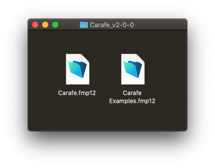
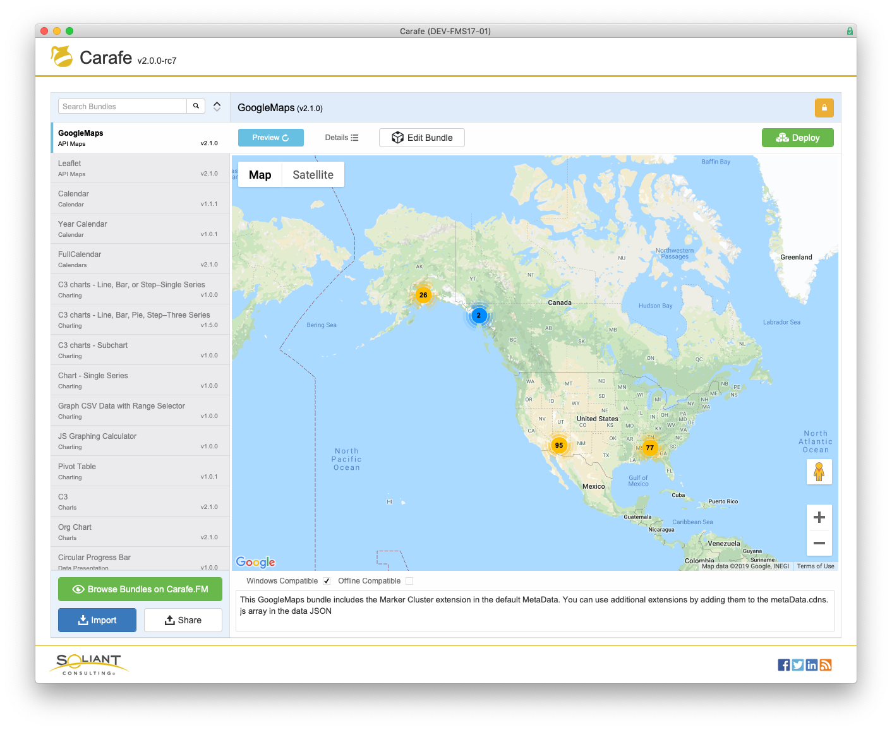
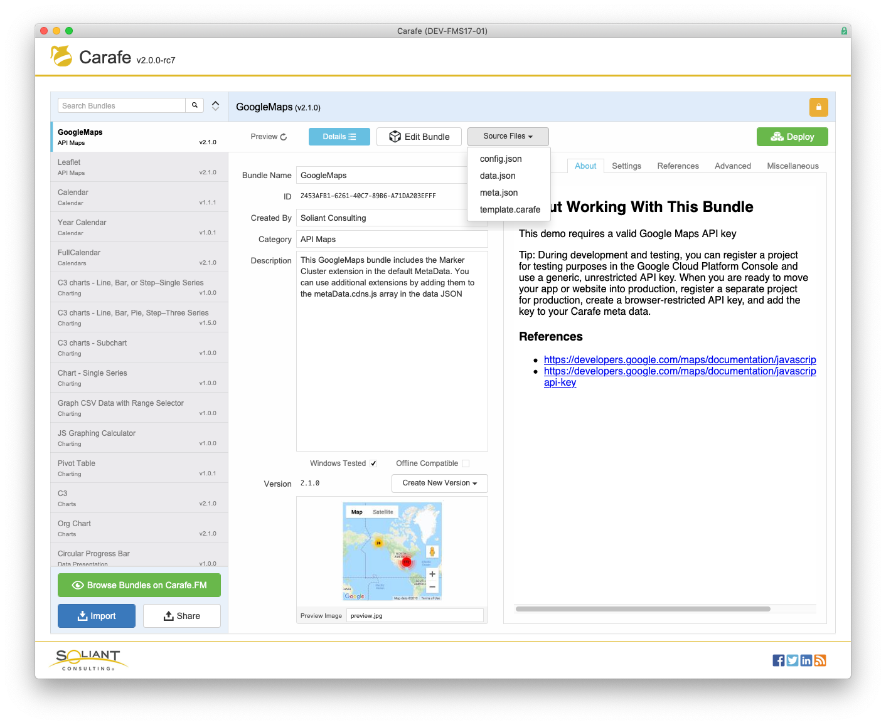

# Components

_Carafe.fmp12_ is a FileMaker Pro file. It ships with a _Carafe Examples.fmp12_ companion file. Carafe.fmp12 requires the free, open source [BaseElements Plugin](https://baseelementsplugin.zendesk.com/hc/en-us). It will automatically check for the plugin, and attempt to install it as needed.

# Download

The latest version can always be found at [Carafe.FM/download/latest/](https://carafe.fm/download/latest/). Should you ever need to find an older version, you can browse [Carafe.FM/downloads/](https://carafe.fm/downloads/)

# Basic Usage

Carafe.fmp12 primarily consists of a master/detail view of Bundles. It ships pre-loaded with a few dozen community contributed Bundles. There are two basic views of a Bundle: Preview and Details.

When you have the Details view open, you can see all the meta data and source files that make up the Bundle.

